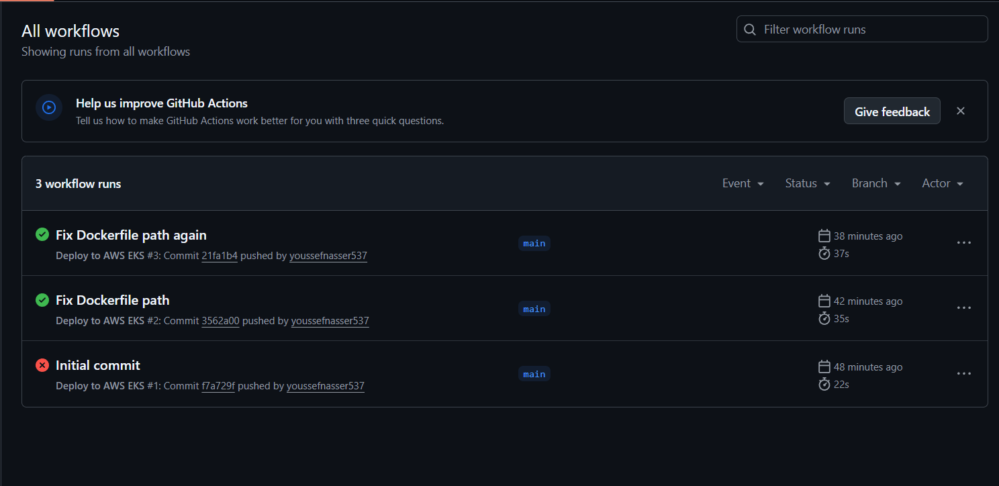
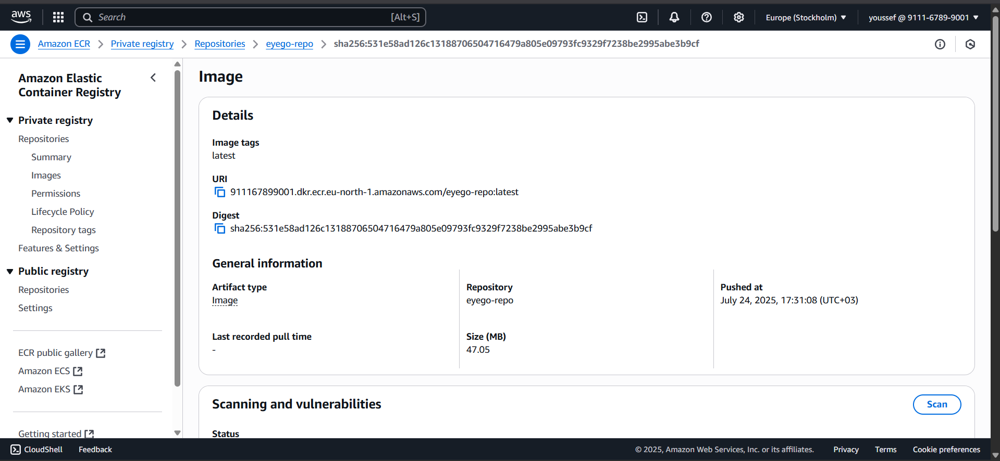
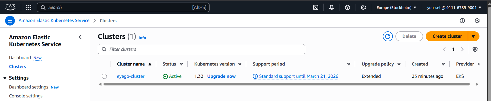

# Eyego DevOps Task – Containerized Node.js App Deployment on AWS EKS

This project shows how I containerized a Node.js app, pushed it to Amazon ECR, and deployed it on AWS EKS using GitHub Actions.

## 🔧 Tools Used
* Docker
* AWS ECR
* AWS EKS
* GitHub Actions
* kubectl

## 📦 Project Structure
```
.
├── .git/                           # Git repository files
├── .github/                        # GitHub Actions workflows
│   └── workflows/
│       └── deploy.yml              # CI/CD pipeline for build & deploy
├── k8s/                            # Kubernetes manifests
│   ├── deployment.yaml
│   └── service.yaml
├── MIGRATION.md                    # Migration to GCB EKS documentation 
└── web_app/                        # Node.js web app
    ├── app.js                      # Main application file
    ├── Dockerfile
    ├── package.json
    └── package-lock.json
```

## 🚀 Steps
1.  Built Docker image from `web_app/`
2.  Pushed it to ECR
3.  Used GitHub Actions to deploy to EKS
4.  App exposed via LoadBalancer service

## 📸 Screenshots

### ✅ GitHub Actions Workflow (Successful)


### 📦 Docker Image Pushed to ECR


### ☸️ App Running on EKS (LoadBalancer)


### ☁️ EKS Cluster Created (eyego-cluster)

